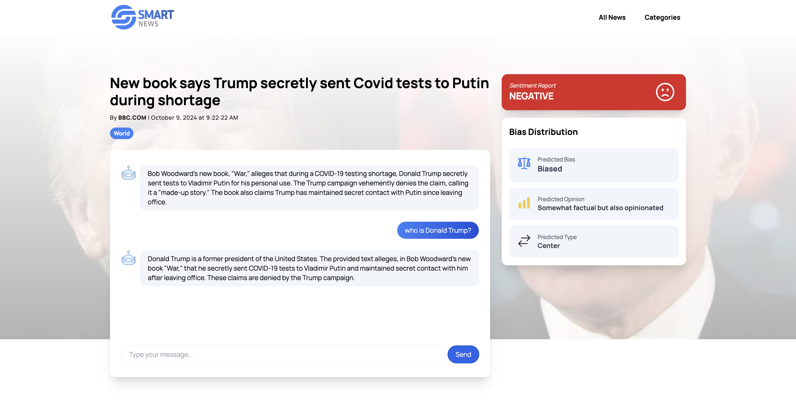

# SMART News - AI-Powered News Analysis Platform




A modern news platform that combines intelligent news curation with AI-powered analysis features including sentiment analysis, bias detection, and interactive chatbot assistance.

## Features

- **Intelligent News Feed**: Personalized news recommendations based on user preferences 
- **AI-Powered Analysis**:
  - Sentiment analysis for news articles
  - Bias detection and political leaning classification
  - Opinion vs. factual content classification
- **Interactive AI Chatbot**: Discuss and get context about news articles
- **Category-Based Navigation**: Browse news by categories (World, Technology, Sports, Business, etc.)
- **Responsive Design**: Modern, mobile-friendly interface built with React and Tailwind CSS

## Project Structure

```
TDP_Project/
├── backend/                 # FastAPI backend server
│   ├── main.py             # Main FastAPI application
│   ├── bias_detection.py   # ML model for bias detection
│   ├── requirements.txt    # Python dependencies
│   └── newsdata.json      # News data storage
├── client/                 # React frontend application
│   ├── src/               # Source code
│   ├── public/            # Static assets
│   └── package.json       # Node.js dependencies
└── README.md              # This file
```

## Tech Stack

### Backend
- **FastAPI**: Modern Python web framework
- **Google Gemini AI**: For chatbot and content analysis
- **Transformers**: BERT-based sentiment analysis
- **TensorFlow/PyTorch**: Machine learning models
- **RapidAPI**: News data fetching

### Frontend
- **React 18**: Modern React with hooks
- **TypeScript**: Type-safe JavaScript
- **Tailwind CSS**: Utility-first CSS framework
- **Vite**: Fast build tool
- **React Router**: Client-side routing
- **Axios**: HTTP client

## Getting Started

### Prerequisites
- Node.js (v18 or higher)
- Python 3.11+ (Python 3.13 may have compatibility issues)
- Git

### Backend Setup

1. **Navigate to backend directory**:
   ```bash
   cd backend
   ```

2. **Create virtual environment**:
   ```bash
   python3 -m venv venv
   source venv/bin/activate  # On Windows: venv\Scripts\activate
   ```

3. **Install dependencies**:
   ```bash
   pip install fastapi "uvicorn[standard]" google-generativeai transformers torch python-dotenv requests
   ```

4. **Set up environment variables**:
   Create a `.env` file in the backend directory:
   ```env
   GEMINI_API=your_google_gemini_api_key
   RAPID_API_KEY=your_rapidapi_key
   ```

5. **Start the backend server**:
   ```bash
   uvicorn main:app --reload
   ```
   Server will be available at `http://localhost:8000`

### Frontend Setup

1. **Navigate to client directory**:
   ```bash
   cd client
   ```

2. **Install dependencies**:
   ```bash
   npm install
   ```

3. **Start the development server**:
   ```bash
   npm run dev
   ```
   Application will be available at `http://localhost:5173`

## API Keys Required

### Google Gemini API
1. Go to [Google AI Studio](https://makersuite.google.com/app/apikey)
2. Create a new API key
3. Add to `.env` file as `GEMINI_API`

### RapidAPI (for news data)
1. Sign up at [rapidapi.com](https://rapidapi.com)
2. Subscribe to a news API (e.g., NewsCaf API)
3. Add to `.env` file as `RAPID_API_KEY`

## Usage

1. **First Visit**: Set your news preferences in the modal
2. **Browse News**: View personalized news feed on homepage
3. **Explore Categories**: Browse news by specific categories
4. **Article Analysis**: Click on the chat icon next to each article to view detailed analysis including:
   - Sentiment analysis (Positive/Negative/Neutral)
   - Bias detection (for World news)
   - Interactive AI chat about the article

## License

This project is licensed under the MIT License - see the [LICENSE](LICENSE) file for details.

## Acknowledgments

- Google Gemini AI for powering the chatbot
- Hugging Face Transformers for sentiment analysis models
- RapidAPI for news data access